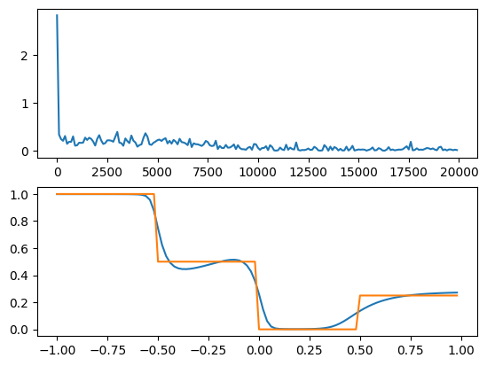
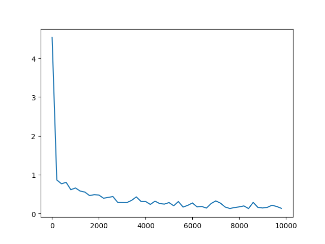
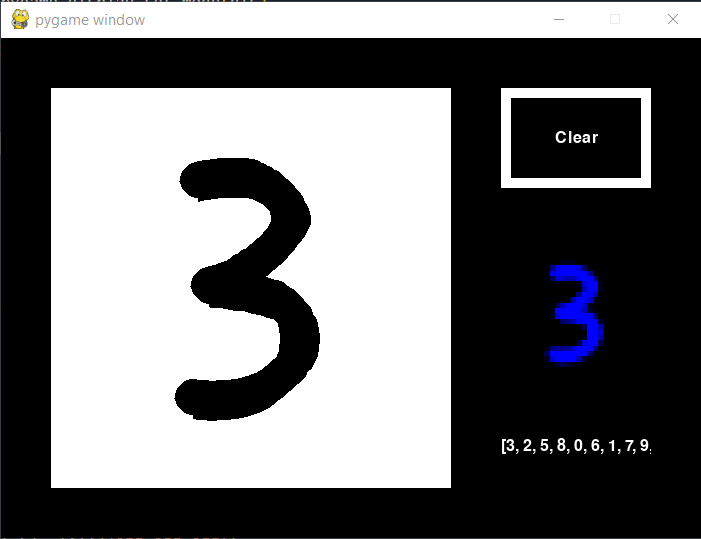
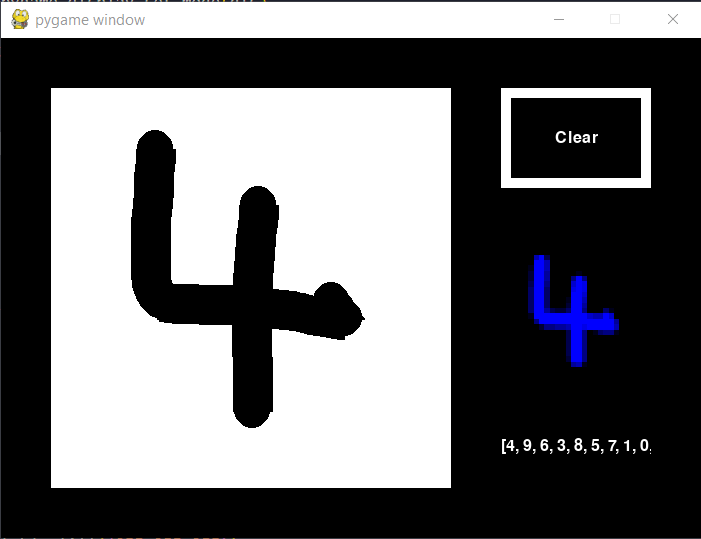
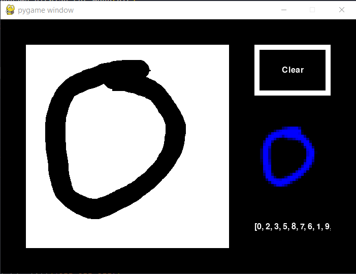
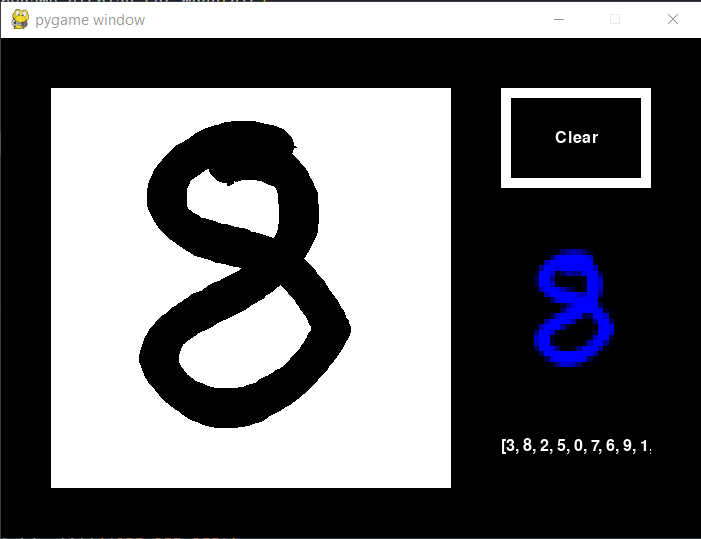

# Neural networks

neuralNets.py includes a neural network class that allows the configuation and training of a neural network. Using numpy arrays, the network can be any size. It trains via gradient descent to approximate functions.

# Test 1

To first test the models to make sure training is working correctly, i trained a simple 3 layer 5 neuron network, with 1 input and 1 output to an arbitary function using the sigmoid activation function. The top graph below shows the cost of the network decreasing over training, and the bottom graph shows how the output of the network function compares to the output of the training function within the training data.

# Handwritten digit recognition

To continue further, I trained networks to recognise handwritten digits. This network also had 3 layers, the first of which has 784 neurons for the 28 by 28 input image. The next layer has 15 neurons and the output layer has a neuron for each of the 10 digits 0-9.

(characters.py is the training script)

Below shows the cost decreasing during training

I then wrote a program to verify the network and test its ability in a real application. (this prog
ram is DigitRecognition.py)

The array of sorted probabilities of each of the characters is written in the bottom right

\* as seeen above it is not 100% accurate